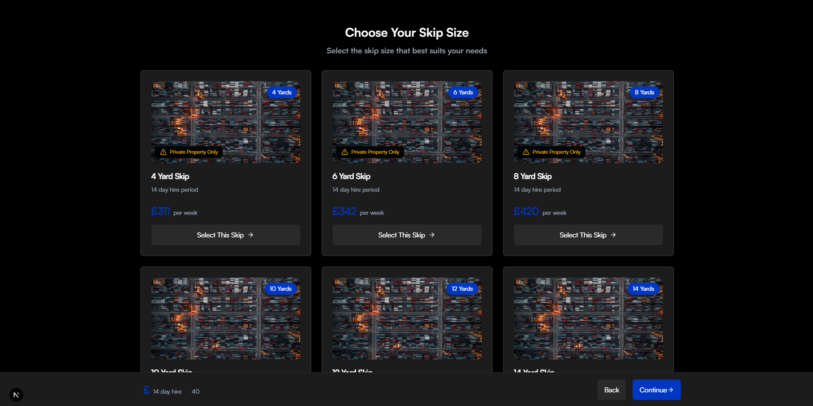

## Introduction

This project is a redesigned Skip Select Page for [WeWantWaste](https://wewantwaste.co.uk/), built with React for improved UI/UX and responsiveness. It fetches skip options dynamically from [this API](https://app.wewantwaste.co.uk/api/skips/by-location?postcode=NR32&area=Lowestoft) while maintaining full functionality.



It's built on:

- Next.js - React framework for production
- Tailwind CSS - Utility-first CSS framework
- TypeScript - Static type checking

## Getting Started

### Prerequisites

To get started with this, ensure you have the following prerequisites installed and set up:

- Node.js 20.18.0 or later

### First, run the development server:

```bash
npm run dev
# or
yarn dev
# or
pnpm dev
# or
bun dev
```

Open [http://localhost:3000](http://localhost:3000) with your browser to see the result.

## Deploy on Vercel

The easiest way to deploy your Next.js app is to use the [Vercel Platform](https://vercel.com/new?utm_medium=default-template&filter=next.js&utm_source=create-next-app&utm_campaign=create-next-app-readme) from the creators of Next.js.

Check out our [Next.js deployment documentation](https://nextjs.org/docs/app/building-your-application/deploying) for more details.
